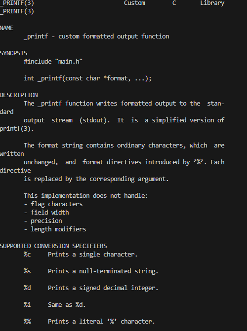
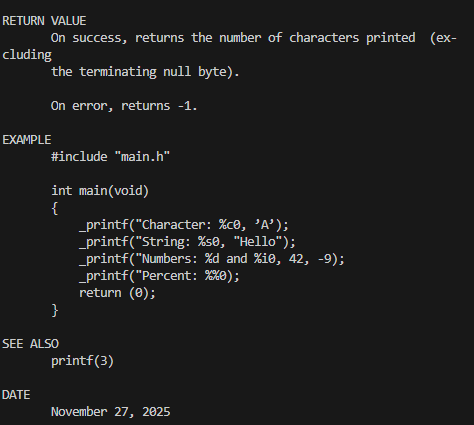
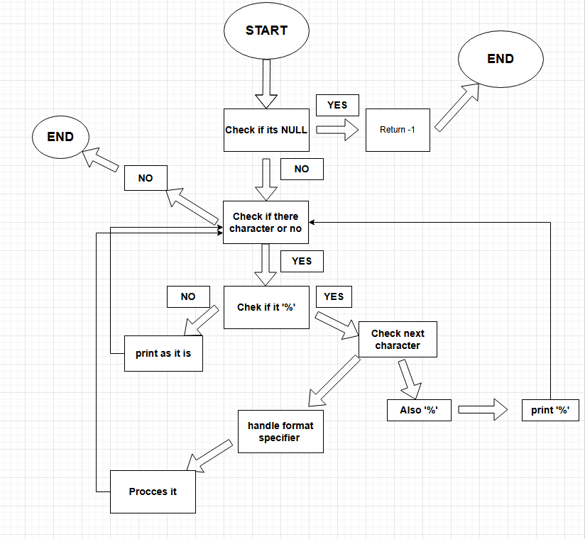

THE TITLE OF THE PROJECT IS PRINTF
Creation of our own printf function / The creation of our printf function will allow us to display a character string, whether it is a positive number, a negative number, an integer, an octal integer, unknowns, a string, a character, or a hexadecimal integer, followed by an output in a specific format.
$ gcc -Wall -Werror -Wextra -pedantic -std=gnu89 -Wno-format *.c
THE REQUIREMENTS THAT WILL ALLOW US TO USE THE FUNCTION CORRECTLY ARE: A README.md file, at the root of the folder of the project is mandatory./ Our code must comply with the Betty style. It will be checked using the betty-style.pl and betty-doc.pl scripts./
We are not permitted to use global variables. / No more than 5 functions per file./
All prototypes for all our functions must be included in our header file called main.h./
We must not forget to transfer our header file./ All header files must be protected by an include tag.
Examples of using the _printf function:
##
## Man page:

## Flowchart: 

